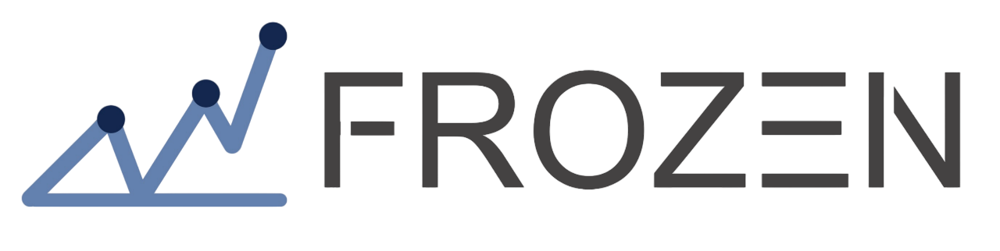

===============================
``Frozen``: Quantitative Platform
===============================

Introduction
============

``Frozen`` is an advanced factor-driven quantitative research platform, which aims to seamlessly integrate data processing, research analytics, back-testing, and live-trading into a unified pipeline, while standardizing factor research procedures through a systematic and rigorous approach.

With ``Frozen``, users can easily try their ideas to create better Quant investment strategies.

Framework
=========

.. image:: ../_static/img/platform.svg
    :align: center

At the module level, Qlib is a platform that consists of above components. The components are designed as loose-coupled modules and each component could be used stand-alone.

This framework may be intimidating for new users to Qlib. It tries to accurately include a lot of details of Qlib's design.
For users new to Qlib, you can skip it first and read it later.

===========================  ==============================================================================
Name                         Description
===========================  ==============================================================================
`Infrastructure` layer       `Infrastructure` layer provides underlying support for Quant research.
                             `DataServer` provides high-performance infrastructure for users to manage
                             and retrieve raw data. `Trainer` provides flexible interface to control
                             the training process of models which enable algorithms controlling the
                             training process.

`Learning Framework` layer   The `Forecast Model` and `Trading Agent` are trainable. They are trained
                             based on the `Learning Framework` layer and then applied to multiple scenarios
                             in `Workflow` layer. The supported learning paradigms can be categorized into
                             reinforcement learning and supervised learning.  The learning framework
                             leverages the `Workflow` layer as well(e.g. sharing `Information Extractor`,
                             creating environments based on `Execution Env`).

`Workflow` layer             `Workflow` layer covers the whole workflow of quantitative investment.
                             Both supervised-learning-based strategies and RL-based Strategies
                             are supported.
                             `Information Extractor` extracts data for models. `Forecast Model` focuses
                             on producing all kinds of forecast signals (e.g. *alpha*, risk) for other
                             modules.  With these signals `Decision Generator` will generate the target
                             trading decisions(i.e. portfolio, orders)
                             If RL-based Strategies are adopted, the `Policy` is learned in a end-to-end way,
                             the trading decisions are generated directly.
                             Decisions will be executed by `Execution Env`
                             (i.e. the trading market).  There may be multiple levels of `Strategy`
                             and `Executor` (e.g. an *order executor trading strategy and intraday order executor*
                             could behave like an interday trading loop and be nested in
                             *daily portfolio management trading strategy and interday trading executor*
                             trading loop)

`Interface` layer            `Interface` layer tries to present a user-friendly interface for the underlying
                             system. `Analyser` module will provide users detailed analysis reports of
                             forecasting signals, portfolios and execution results
===========================  ==============================================================================

- The modules with hand-drawn style are under development and will be released in the future.
- The modules with dashed borders are highly user-customizable and extendible.

(p.s. framework image is created with https://draw.io/)
